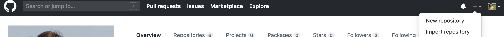
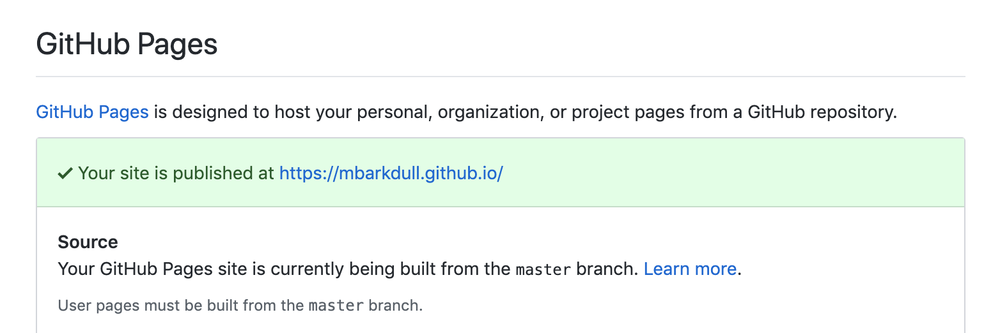
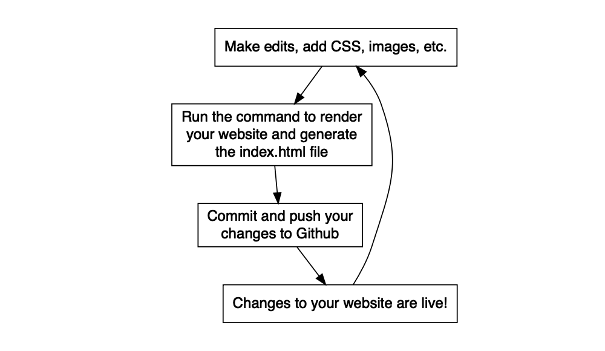
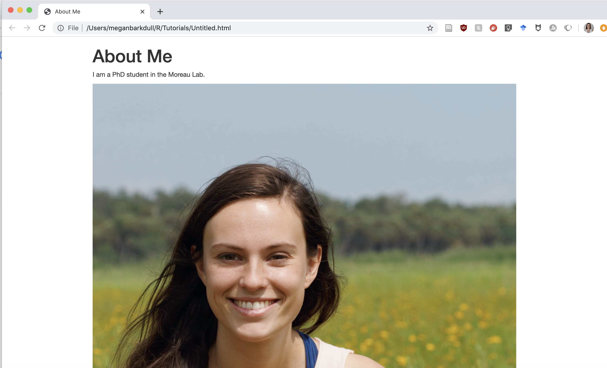

Making a Personal Website with Github and R
================

This tutorial describes how to create your own personal website with
Github and Rmarkdown. It is largely based on this [wonderful
tutorial](http://nickstrayer.me/RMarkdown_Sites_tutorial/) by Nick
Strayer and Lucy D’Agostino McGowan.

## Getting set up with Git, Github, and Rstudio:

To make your website, you’ll need to have Git installed on your
computer, connected to a Github account, and communicating with RStudio.
Follow the [lab
tutorial](https://github.com/Moreau-Lab/Tutorials/blob/master/GitGitHubTutorial.md)
to get this all set up ahead of time.

## Creating a repository for your website:

First, you will need to create a repository for your website, which will
house all of the code, images, and other files that come together to
make the site. Click the + button in the top right corner of your Github
page, and click “New Repository”.

In order to have the cleanest url for your website, you will want to
name your repository the exact same thing as your Github username, plus
“.github.io” (e.g., I named mine “mbarkdull.github.io”). This will
ensure that your website url is username.github.io. Be sure to
initialize the repository with a ReadMe so that you can clone it.

Once your repository is created, click the green Clone or Download
button, and copy the url to clone your repository.

Open RStudio on your computer, and [create a new project initialized
from your Github
repository](https://github.com/Moreau-Lab/Tutorials/blob/master/GitGitHubTutorial.md#get-things-set-up-in-rstudio).

In order to ensure that Github pages sets your website up correctly,
you’ll need to go back to the repository on Github, and tell Github
that it should look for our website files on the master branch. To do
this, click the “settings” button in your repository, scroll down to
“Github Pages”, and select “master” under the “Source” dropdown menu.

 

Now we are all set up to actually add content to the website\!

## Creating Markdown files for your website:

First, make sure that you have the most recent version of rmarkdown
installed, and load it in R:

    install.packages("rmarkdown", type = "source")
    library(rmarkdown)

Let’s create the basic files needed to put a website together. Open
terminal, and change directories to the directory that corresponds to
your website repository. Create the following files:

    touch _site.yml 
    touch index.Rmd 
    touch about.Rmd 

`_site.yml` is a file that tells Github how all of your website pages
will be assembled. `index.Rmd` is basically a homepage for your website.
`about.Rmd` will be an about page for the website. Go ahead and open all
of these files in Rstudio.

First, fill out your `_site.yml`; obviously, change the text to match
what you want for your website:

    name: "YOUR-WEBSITE-NAME"
    output_dir: "."
    navbar:
      title: "Your website name"
      left:
        - text: "Home"
          href: index.html
        - text: "About Me"
          href: about.html

Next we will add the minimum info to the two `.Rmd` files. For
`index.Rmd`, add:

    ---
    title: "Your website name"
    ---
    
    Hello, World!

And to `about.Rmd`, add:

    ---
    title: "About Me"
    ---
    
    Why I am awesome. 

## Turning everything into a website:

Save all of those files, and now let’s connect everything together to
form a website. Go to RStudio and run the command:

    rmarkdown::render_site()

This generates a file, `index.html`, that corresponds to your website\!
You can open this file up in a web browswer and see a preview of what
your website will look like.

## Getting the website online:

Now we need to take your website and put it online, so that other people
can check it out\! To do this, we need to [commit your changes and push
everything to
Github](https://github.com/Moreau-Lab/Tutorials/blob/master/GitGitHubTutorial.md#make-a-change-save-it-commit-it).

Once you’ve pushed things to Github, you’ll be able to see your website
at yourusername.github.io (be patient, it takes a few seconds for the
changes to load onto
Github).

## Adding information and making things look nice:

Your website is built using Rmarkdown, and can also incorporate HTML and
CSS. When trying to figure out how to add or format something, doing
some Googling using those search terms is a good starting point.

### Adding more info, images, etc.

Say you’d like to add some text and an image to your about page. You can
do this by adding any file you want to embed *to your website
directory*, and then editing the corresponding `about.Rmd` file:

    ---
    title: "About Me"
    ---
    
    I am a PhD student in the Moreau Lab. 
    
    

Once you’ve made your changes, just run `rmarkdown::render_site()` again
to recompile the site. This will produce:

### Adding additional pages:

To add more pages, you need to do three things:

1.  Edit the `_site.yml` file so that your new pages are listed:

<!-- end list -->

    name: "YOUR-WEBSITE-NAME"
    output_dir: "."
    navbar:
      title: "Your website name"
      left:
        - text: "Home"
          href: index.html
        - text: "About Me"
          href: about.html
        - text: "Contact"
          href: contact.html

2.  Create `.Rmd` files that correspond to the `.html` file that you
    specified. So in this case, to add my contact page, I would open
    terminal, change directories to my website directory, and create
    `contact.Rmd` by executing `touch contact.Rmd`.
3.  Fill out the new `.Rmd` page with the information you’d like to add.

<!-- end list -->

    ---
    title: "Contact"
    ---
    
    Here is my email:

### Formatting with CSS:

One way to apply formatting to your website is with CSS. For example,
[Megan](https://mbarkdull.github.io) used CSS to change the background
colors and fonts on her website. To do this, you’ll want to:

1.  Create a CSS file in terminal using `touch NAMEOFFILE.css`
2.  Open that file in RStudio, and add whatever CSS code you would like
    to it. For example, to change your background color to a light
    lavender, add:

<!-- end list -->

    body {
      background-color: rgba(225, 219, 229)   /*light muted lavender */;
    }

3.  Apply the CSS to your website. Inside of the three dashes (`---`)
    that enclose the title section, add this code:

<!-- end list -->

    output:
      html_document:
        css: NAMEOFFILE.css

  - If you add this to your `_site.yml` page, the CSS will be applied to
    every page in your website.
  - If you only want to apply it to some pages, then only add that
    particular CSS file to those pages.
  - You can apply multiple CSS files by enclosing them all in square
    brackets and enclosing each one in quotes (`["CSS1.css",
    "CSS2.css"]`).

## Getting inspiration from one another:

A good way to get inspired and learn new things you can do with your
website is to look at what other folks have done. Moreau lab members’
website repositories can be found here:

[Megan’s repository](https://github.com/mbarkdull/mbarkdull.github.io)

[Jaime’s
repository](https://github.com/jaimeortiz-david/jaimeortiz-david.github.io)

[Phoebe’s repository](https://github.com/phoebekoenig/profwebsite)
