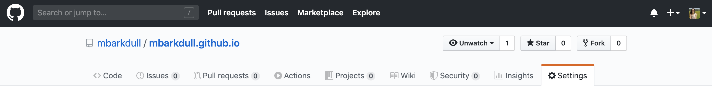

Making a Personal Website with Github and R
================

## Getting set up with Git, Github, and Rstudio:

To make your website, you’ll need to have Git installed on your
computer, connected to a Github account, and communicating with RStudio.
Follow the [lab
tutorial](https://github.com/Moreau-Lab/Tutorials/blob/master/GitGitHubTutorial.md)
to get this all set up ahead of time.

## Creating a repository for your website:

First, you will need to create a repository for your website, which will
house all of the code, images, and other files that come together to
make the site. Click the + button in the top right corner of your Github
page, and click “New Repository”.

In order to have the cleanest url for your website, you will want to
name your repository the exact same thing as your Github username (e.g.,
I named mine "mbarkdull). This will ensure that your website url is
username.github.io. Be sure to initialize the repository with a ReadMe
so that you can clone it.

Once your repository is created, click the green Clone or Download
button, and copy the url to clone your repository.

Open RStudio on your computer, and [create a new project initialized
from your Github
repository](https://github.com/Moreau-Lab/Tutorials/blob/master/GitGitHubTutorial.md#get-things-set-up-in-rstudio).

In order to ensure that Github pages sets your website up correctly,
you’ll need to go back to the repository on Github, and tell Github
that it should look for our website files on the master branch. To do
this, click the “settings” button in your repository, scroll down to
“Github Pages”, and select “master” under the “Source” dropdown menu.

 

Now we are all set up to actually add content to the website\!

## Creating Markdown files for your website:
