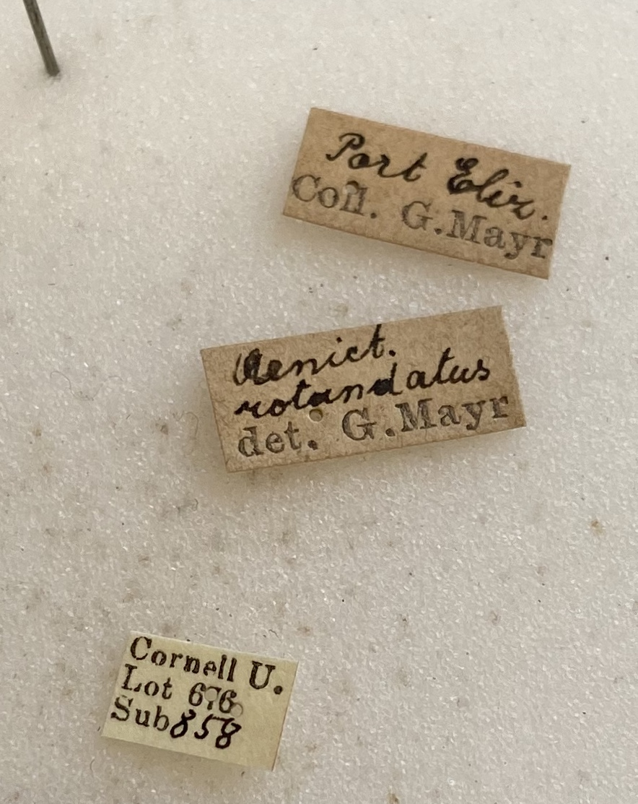
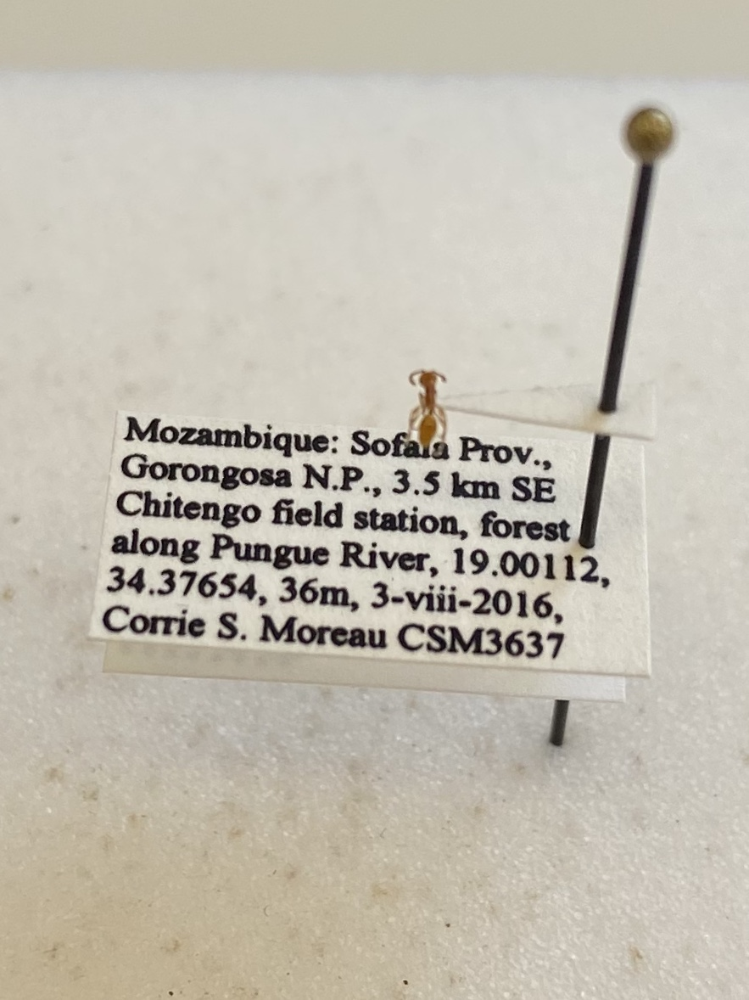

```{r setup, include=FALSE}
knitr::opts_chunk$set(echo = TRUE)
library(knitr)
```


## Databasing the Cornell University Insect Collection Ants
Steps: 

  1. Collect your supplies:
      + A sheet of labels with QR codes
      + Scissors
      + Forceps
      + A foam block
  2. Pull out the drawer of ants that you're working on.
  3. Find the unit tray that you're working on and pull it out. 
  4. Carefully remove the first specimen and pin it to your foam block. Take a look at the labels that it bears:
      + If it bears several labels that are hard to read while on the pin, carefully remove the labels by pushing the pin into your foam block, positioning your forceps above the top-most label, and pushing the labels down and off the pin. 
          + **Always push with your forceps down and away from the specimen, so they can't slip and damage it**.  
          + Make sure to keep track of the order in which the labels were on the pin, so they can be replaced in the same order. 

 

  5. Enter the label data into your databasing spreadsheet. 
      + The degree of completeness will vary (drastically) from label to label. 
      
      
If you break an ant:
Don't throw it away!
Don't hide it!
Broken specimens can be repaired with hide glue. If just a leg or antenna is knocked off, you can also glue it to the point. 
If it's really destroyed, you can take a gel cap, put the pieces in there, and pin the gel cap onto the pin. 