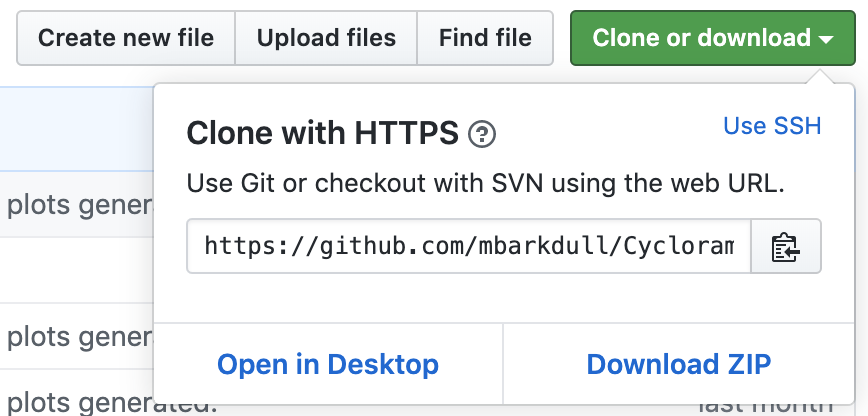

```{r setup, include=FALSE}
knitr::opts_chunk$set(echo = TRUE)
```

## Setting Up GitHub and Git
### Making a GitHub account
Go to github.com and make an account. 

### Connecting to the Moreau Lab Organization 
Our lab GitHub organization can be found at https://github.com/Moreau-Lab. This is where we keep all of our code, organized into shared repositories, to enable collaboration and ensure reproducibility of our research!

You will need to request to be added to the organization; let Corrie or Megan know what email is associated with your GitHub account and they can send you an invitation to join. 

### Setting Up Git on Your Computer 
Now that you have a GitHub account, let's get your computer set up with Git, the version control tool that underlies GitHub. 

First, install Git on your computer. 

Next, you'll need to tell Git who you are. We will do this using the following commands in Terminal:
```
# Give Git your username and the email you used to sign up for GitHub:
    git config --global user.name 'YOURUSERNAME'
    git config --global user.email 'YOURGITHUBEMAIL'

# Now check that everything was input correctly.
    git config --global --list
```

Now that Git knows who you are, let's practice pushing from GitHub to your computer and back, using Terminal. The vast majority of the time you will not be using Terminal to interact with GitHub, but this is a good way to check that everything is set up correctly from the beginning. 

First, make a new repository with GitHub in your browser; initialize it with a ReadMe file. Open the repository, and look for the green Clone or download button. Click it, and copy the url that appears. 
```{r, out.width = "400px", echo = FALSE}

```


This is an R Markdown document. Markdown is a simple formatting syntax for authoring HTML, PDF, and MS Word documents. For more details on using R Markdown see <http://rmarkdown.rstudio.com>.

When you click the **Knit** button a document will be generated that includes both content as well as the output of any embedded R code chunks within the document. You can embed an R code chunk like this:

```{r cars}
summary(cars)
```

## Including Plots

You can also embed plots, for example:

```{r pressure, echo=FALSE}
plot(pressure)
```

Note that the `echo = FALSE` parameter was added to the code chunk to prevent printing of the R code that generated the plot.
