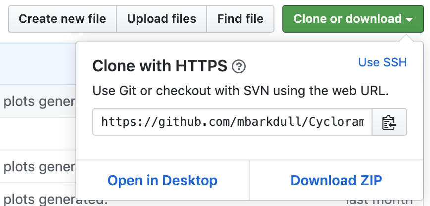

Intro to Using Git and GitHub
================

## Setting Up GitHub and Git

Much of the following information is adapted from [The University of
Chicago’s Computing for the Social Science’s Github
guide](https://cfss.uchicago.edu/setup/github/) and [Happy Git With
R](https://happygitwithr.com/install-git.html). If you’re having trouble
with a particular step, definitely check out these more detailed
resources.

### Making a GitHub account

Go to [github.com](github.com) and make an account.

### Connecting to the Moreau Lab Organization

Our lab GitHub organization can be found
[here](https://github.com/Moreau-Lab). This is where we keep all of our
code, organized into shared repositories, to enable collaboration and
ensure reproducibility of our research\!

You will need to request to be added to the organization; let Corrie or
Megan know what email is associated with your GitHub account and they
can send you an invitation to join.

### Setting Up Git on Your Computer

Now that you have a GitHub account, let’s get your computer set up with
Git, the version control tool that underlies GitHub.

First, install Git on your computer. [This
link](https://git-scm.com/book/en/v2/Getting-Started-Installing-Git)
should get you set with whatever operating system you are using.

Next, you’ll need to tell Git who you are. We will do this using the
following commands in Terminal:

Give Git your username and the email you used to sign up for GitHub:

    git config --global user.name 'YOURUSERNAME'
    git config --global user.email 'YOURGITHUBEMAIL'

Now check that everything was input correctly.

    git config --global --list

#### Pushing from your computer to GitHub

Now that Git knows who you are, let’s practice pushing from GitHub to
your computer and back, using Terminal. The vast majority of the time
you will not be using Terminal to interact with GitHub, but this is a
good way to check that everything is set up correctly from the
beginning.

First, make a new repository with GitHub in your browser; initialize it
with a ReadMe file. Open the repository, and look for the green Clone or
download button. Click it, and copy the url that appears.

Now, open Terminal again. Let’s clone that repository from GitHub onto
our local computer:

    git clone URLTHATYOUCOPIED

Let’s navigate into the directory of that repository, and make an edit
to the ReadMe file.

    cd NAMEOFREPOSITORY
    echo "A line I wrote on my local computer" >> README.md
    git status

Once we’ve made this edit, we can push the new version of our ReadMe
from our local computer out to GitHub, like this:

    git add -A
    git commit -m "A commit from my local computer"
    git push

At this point, you should probably be prompted to enter your GitHub
username and password in Terminal; go ahead and do so. Then, refresh
GitHub in your browser, and hopefully the updated ReadMe file will be
there. This tells us we have successfully connected Git on our local
computer to GitHub online\!

#### Cleaning Up

You can go ahead and use Finder or whatever file system navigatory your
computer uses to find the “Test” folder you created on your computer,
and delete it. You can also delete the “Test” repository from GitHub.
Open up the repository on github.com; click Settings, scroll to the very
bottom, and delete the repository. This will keep everything tidy and
uncluttered.

## Connecting RStudio to GitHub

Working via Terminal can be annoying and fairly confusing to folks who
aren’t comfortable with it. Luckily, we can actually use RStudio as our
tool for pushing files to GitHub. Let’s get that set up.

In general, the best and easiest way to structure your workflow when
using RStudio and GitHub together is to create a repository on GitHub
**first**, then doing our R work inside the directory that corresponds
to the GitHub repository. This will make pushing and pulling files very
easy. It’s essentially the same as doing `git clone`, but you don’t have
to wrangle Terminal each time. Let’s get started.

### Make a new repository for your project on GitHub

Go to Github in your browser. Make a new repository, and give it a
meaningful name that corresponds to a project you’re working on (or, if
this is just a test, call it something like Test). Initialize the
repository with a ReadMe, and copy the HTTPS URL like we did above (with
the green button).

### Get things set up in RStudio

Open up RStudio. Start a new project by going to: *File \> New Project
\> Version Control \> Git*.

In the space for “repository URL”, paste the URL that you previously
copied. Now click “Create project”. **Note** that if you are trying to
reuse the test repository that you used for the above steps, you will
need to delete the directory from your computer or you’ll get an error
in RStudio. Follow the clean-up steps described above.

This new project is 1) a directory, or folder, on your computer; 2) a
Git repository on your computer, connected to a GitHub repository in the
cloud; and 3) and RStudio Project file. **Because we started the GitHub
repository first, then connected an RStudio Project to it**, we are
automatically all set up to push and pull files.

#### Make a change, save it, commit it

In RStudio, open your `README.md` file, and make some kind of edit, like
adding the line “this is an edit from RStudio”. Save your changes.

Now commit your change locally. Click the “Git” tab in the upper right
pane of RStudio: 

Decide which files you want to commit (in other words, which files
you’ve made meaningful changes to since the last time you committed
them). Check the “Staged” box for these files. Click the “Commit”
button. **Be sure to write a meaningful message** in the “Commit
Message” box; this should describe the nature of the changes you’ve
made to the file since you last committed it. For example: “I added code
to generate a PCA plot that depicts the similarity of bacterial
communities in different ant samples”. **Make it meaningful** so that
collaborators, and your future self, know what you did and why\!

Now those changes are committed in Git locally\!

#### Push local commits to GitHub

Once you’ve committed something locally, you need to push it to GitHub
in order for it to be incorporated online and available to collaborators
(including your future self\!).

First, click the blue “Pull” arrow button in the “Git” tab of RStudio.
This will make sure your file incorporates any changes a collaborator
may have made since you last worked with the file. Odds are, nothing
will happen, especially if no one else is working on the project with
you, but it is a good habit to get into any.

Next, click the green “Push” arrow button to put your changes to GitHub.
You can check that this worked by refreshing the file in GitHub in your
browser.

#### Clean Up

Like above, you can delete the “Test” repository from your computer and
from GitHub, keeping everything tidy.

# You’re good to go\!

Now make all of these steps a normal part of your workflow, every time
you write and edit code for an analysis. Everything will be kept
up-to-date, and you’ll be able to find and understand your code when you
come back to it after a break. Plus, collaborators will be able to
access it very easily. Yay\!

